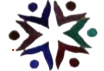

# Tellionsat Aftercare Website



A modern, responsive website for **Tellionsat Aftercare**, designed to showcase the facility's safe, nurturing, and fun environment for children.

🔗 **Live Site:** [tellionsat-aftercare.netlify.com](https://tellionsat-aftercare.netlify.com)

## 📋 Features

-   **Home Page**: Engaging hero section with video background, showcasing key features like "Fun & Learning", "Other Activities", and "Creative Arts".
-   **Gallery**: A visual showcase of the playground, classrooms, and activities.
-   **About Us**: Mission statement and values, featuring an integrated **Google Map** for easy location finding.
-   **Global Navigation**: Sticky navbar for easy access to all sections.
-   **Responsive Design**: Fully optimized for mobile, tablet, and desktop devices.
-   **Contact Integration**: Direct WhatsApp link in the footer for quick inquiries.

## 🛠️ Technology Stack

-   **Frontend**: [React](https://reactjs.org/) (v19)
-   **Build Tool**: [Vite](https://vitejs.dev/)
-   **Routing**: [React Router DOM](https://reactrouter.com/)
-   **Icons**: [Lucide React](https://lucide.dev/)
-   **Styling**: Custom CSS with a global design system (variables for colors, typography, and spacing).

## 🚀 Getting Started

### Prerequisites

Make sure you have [Node.js](https://nodejs.org/) installed.

### Installation

1.  Clone the repository:
    ```bash
    git clone https://github.com/your-username/tellionsataftercare.git
    cd tellionsataftercare
    ```

2.  Install dependencies:
    ```bash
    npm install
    ```

3.  Start the development server:
    ```bash
    npm run dev
    ```
    The app will be available at `http://localhost:5173`.

### Building for Production

To create a production build:

```bash
npm run build
```

The output will be in the `dist` folder, ready for deployment.

## 📍 Location

**Tellionsat Aftercare**
5953 Apple Cres, Roodekop
Germiston, 1401

## 📞 Contact

-   **Phone/WhatsApp**: [078 167 3574](https://wa.me/27781673574?text=Hi%2C%20I%27d%20like%20to%20know%20more)
-   **Email**: info@tellionsat.co.za
-   **Hours**: Mon - Fri: 13:00 PM - 17:00 PM

---

© 2026 Tellionsat Aftercare. Made with love by Odwa Mdanyana.
